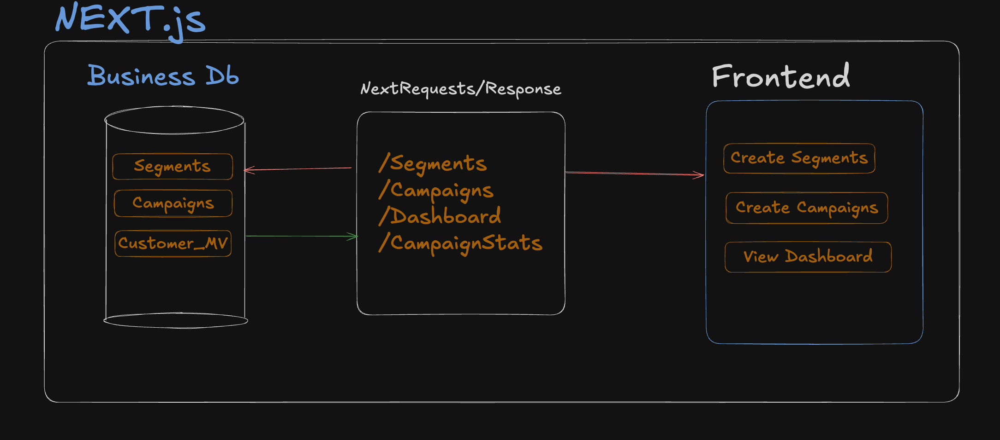

# XenCRM Frontend

An end-to-end Customer Relationship Management (CRM) system built as part of the Xeno SDE Internship Assignment – 2025. The project demonstrates modern engineering practices: microservices architecture, event-driven design, full-stack development, and AI-first integrations.

## Backend Architecture & Design 

## Frontend

- Authenticates via Google OAuth (NextAuth).
- Provides UI to create segments, create campaigns, and view dashboards.
- Communicates with Campaigns DB via APIs (/segments, /campaigns, /dashboard, /campaignStats).

  

## Technology Stack

- **Next.js 15.5.2**
- **TypeScript** with strict configuration
- **Tailwind CSS v4** with shadcn/ui components
- **Prisma ORM** with PostgreSQL database
- **NextAuth.js** for authentication
- **Turbopack** for development and build optimization
- **Recharts** for data visualization

## Next Routes

```
app/dashboard -> #Homepage Dashboard
app/segments -> # Segment Creation UI
app/campaigns -> #Campaing Creation UI
app/campaignStats - > #Displaying Campaign Stats UI

```

## Next API Routes

```
/api/campaings/route.ts -> #Campaign Creation Logic.
/api/segements/route.ts -> #Segement Creation Logic.
/api/dashapi/route.ts -> #Fetched data for the Main dashboard.
/api/campaignstats/route.ts -> #For displaying Past Campaign Stats.
```

## Directory Structure

```
├───prisma/
│   └───schema.prisma
└───src/
    ├───app/
    │   ├───page.tsx
    │   ├───api/
    │   │   ├───auth/
    │   │   │   └───[...nextauth]/
    │   │   │       └───route.ts
    │   │   ├───campaigns/
    │   │   │   └───route.ts
    │   │   ├───campaignstats/
    │   │   │   └───route.ts
    │   │   ├───dashapi/
    │   │   │   └───route.ts
    │   │   └───segments/
    │   │       ├───route.ts
    │   │       ├───[segmentId]/
    │   │       │   └───route.ts
    │   │       └───preview/
    │   │           └───route.ts
    │   ├───campaigns/
    │   │   └───page.tsx
    │   ├───campaignStats/
    │   │   └───page.tsx
    │   ├───dashboard/
    │   │   └───page.tsx
    │   └───segments/
    │       └───page.tsx
    ├───components/
    │   ├───hero.tsx
    │   ├───loginsection.tsx
    │   ├───navbar.tsx
    │   ├───providers/
    │   │   └───SessionProvider.tsx
    │   └───ui/
    │       └───button.tsx
    ├───generated/
    │   └───prisma/...
```
